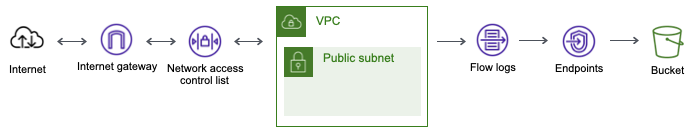

# forensicvpc

Paying by the GB requires a way to narrow the search without having to go back to the well. An index with the IP Address as the primary key and a sort key with additional characteristics are available to help pivot during the investigation.

- Accepted or Rejected
- Source or Destination
- Year, Month, Day & Hour

If you need a way to operationalize your VPC Flows Logs, this option might be the way to go!
